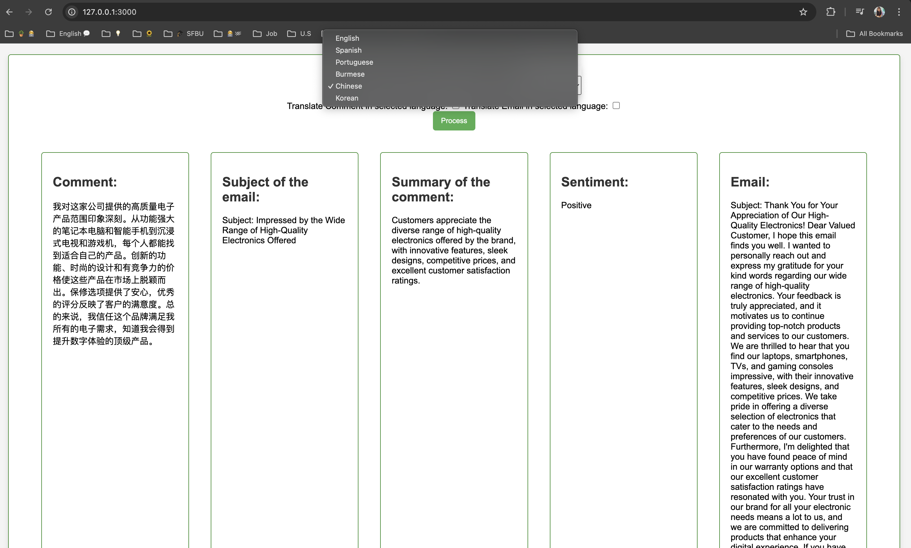
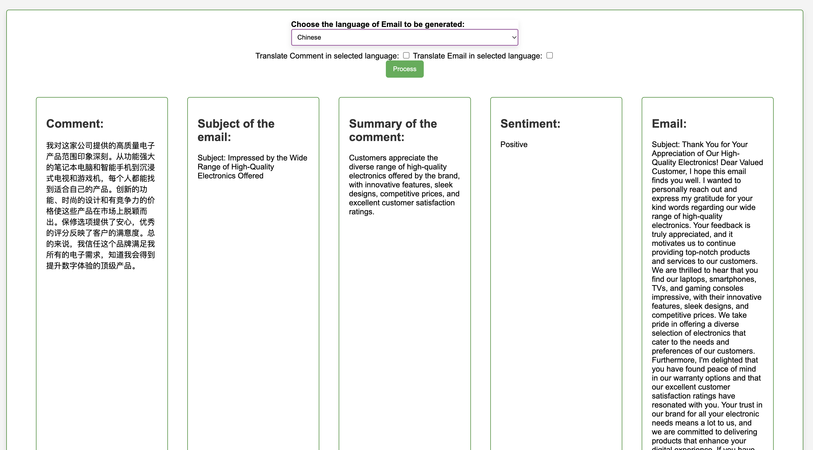
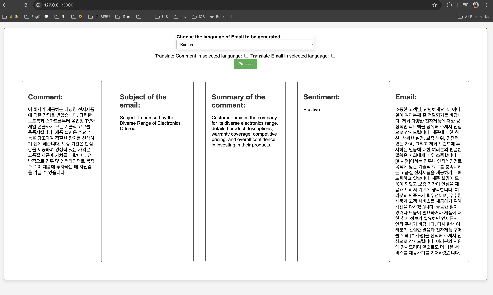

# Customer Support System: An email to the customer
The project is to use ChatGPT Models to send email to customer based on the comment provided for the products in an electronic company. Email will be sent to customer based on text completion techniques appropriately based on the language preferred.

# Documentation
Github Link
https://github.com/YinYinPhyo/CustomerSupportSystem-email-to-customer-?tab=readme-ov-file

Google Slide (PDF)
https://drive.google.com/file/d/15uyTaO2yJy_7Dcj51RCnCu6Ru3YPMoBO/view?usp=sharing

STEPS INVOLVED IN DEVELOPMENT:
•	STEP 1: Generate customer’s comment.
o	An input of the list of products is given and expect a response of about 100 words as a customer comment.

•	STEP 2: Generate email subject.
o	The comment generated is given as input and expect ChatGPT to generate appropriate subject for the email using Inferring technique.

•	STEP 3: Generate summary of customer comments.
o	Based on the comment, expect ChatGPT generate a summary within 30 words.

•	STEP 4: Sentiment analysis of the customer comment.
o	Take the comment as an input and expect to analyze the sentiment of the comment if it is positive or negative using Inferring technique.
o	Since it gave an output with more than 100 words, I just wanted to know if the comment is positive or negative. So, I changed the prompt accordingly.

•	STEP 5: Generate email.
o	Based on all the comment, subject of email, sentiment and summary, expect to generate an email in the selected language by the user.

Output

